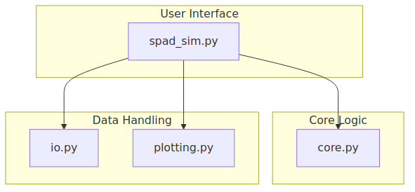
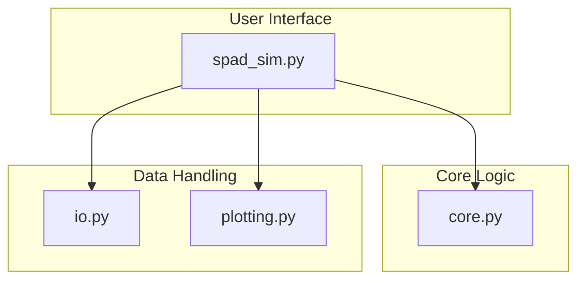
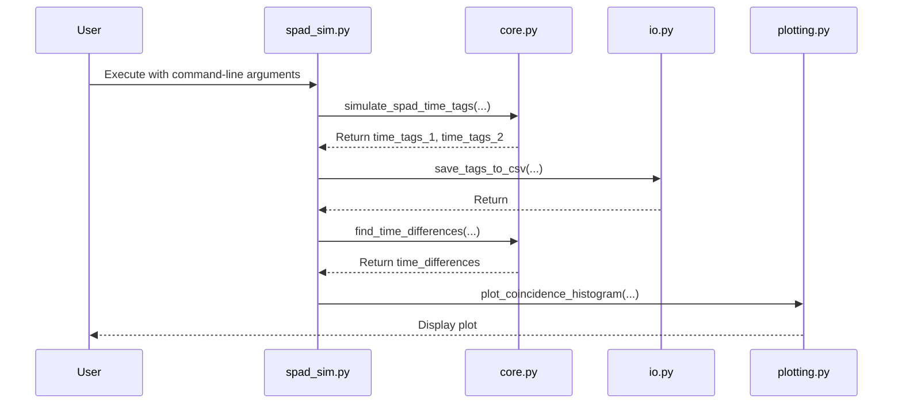

# Design Document: SPAD Simulation Tool

This document provides a comprehensive overview of the SPAD (Single-Photon Avalanche Diode) simulation tool, detailing both the underlying physics and the software architecture.

## 1. The Physics

This section provides a step-by-step walkthrough of the photon's journey, from its creation to its detection, as modeled by the simulation. Each step is accompanied by an explanation of the relevant physical concepts and how they are implemented in the code.

### The Photon's Journey: A Step-by-Step Walkthrough

The simulation models the lifecycle of individual photons, from their generation at a source to their potential detection by one of two single-photon avalanche diodes (SPADs). The following sections describe each step of this journey in detail.

#### 1. Photon Pair Generation

The simulation begins by generating pairs of photons. This process is modeled as a Poisson process, which is a common way to describe the random emission of photons from a source. The time intervals between the emission of each photon pair are drawn from an exponential distribution, which is characteristic of a Poisson process.

*   **Implementation**: The `source_pair_rate_hz` parameter determines the average number of photon pairs generated per second. The `np.random.exponential` function is used to generate the time intervals between each pair's creation, and `np.cumsum` is used to create a timeline of creation events.

#### 2. Path Loss and Quantum Efficiency: The Survival of the Fittest

Once a photon is generated, it must travel from the source to one of the two detectors. During this journey, it may be lost due to various factors, such as absorption or scattering in the medium. This is known as **path loss**.

Even if a photon successfully reaches a detector, it may not be detected. The **quantum efficiency (QE)** of a detector is the probability that it will successfully detect a photon that hits it. The overall probability of a photon being detected is therefore the product of the transmission probability (determined by the path loss) and the quantum efficiency.

*   **Implementation**: The `path_loss1_db` and `path_loss2_db` parameters are used to calculate the transmission probability for each path. This is then multiplied by the respective quantum efficiencies (`qe1` and `qe2`) to get the total detection efficiency for each detector. A random number is then generated for each photon to determine if it is detected.
*   **Further Reading**: The concepts of quantum efficiency and system losses are discussed in the Wikipedia article on [Photon counting](https://en.wikipedia.org/wiki/Photon_counting).

#### 3. Chromatic Dispersion: A Tale of Two Speeds

When photons of different wavelengths travel through a medium like an optical fiber, they travel at slightly different speeds. This effect, known as **chromatic dispersion**, causes the photon pulse to spread out over time. In this simulation, this is modeled as a simple time delay for the photons traveling to the second detector.

*   **Implementation**: The time delay is calculated based on the `distance_km`, the `dispersion_ps_nm_km`, and the difference between `wavelength1_nm` and `wavelength2_nm`. This delay is added to the arrival times of all photons at the second detector.

#### 4. Dark Counts: The Unwanted Guests

SPADs can sometimes fire even when no photon is present. This is known as a **dark count**, and it is caused by the thermal generation of charge carriers within the detector. Dark counts are a source of noise in the system.

*   **Implementation**: The simulation models dark counts as a Poisson process, determined by the `dcr1_hz` and `dcr2_hz` parameters. The dark count times are generated by drawing from a uniform distribution over the simulation time.
*   **Further Reading**: The Wikipedia article on [Single-photon avalanche diodes](https://en.wikipedia.org/wiki/Single-photon_avalanche_diode) provides a good overview of dark counts and other SPAD characteristics.

#### 5. Timing Jitter: The Uncertainty of Arrival

There is a small amount of uncertainty in the time between a photon's arrival and the generation of the corresponding electrical pulse. This is known as **timing jitter**, and it limits the temporal resolution of the system.

*   **Implementation**: Timing jitter is modeled by adding a random value drawn from a normal distribution to each detection event time. The standard deviation of this distribution is determined by the `jitter1_s` and `jitter2_s` parameters.

#### 6. Dead Time: The Refractory Period

After a SPAD detects a photon, it needs a short amount of time to "reset" before it can detect another one. This is known as the **dead time**. Any photons that arrive during this period are not detected.

*   **Implementation**: The simulation implements dead time by iterating through the sorted list of detection events and discarding any that fall within the dead time of a preceding event. The `dead_time1_s` and `dead_time2_s` parameters are used for this purpose.

## 2. The Software

This section outlines the software architecture, modules, and data flow. The tool is designed as a command-line application with a modular structure, separating the core simulation logic from I/O and plotting functionalities.

### Module Breakdown

The application is divided into the following key modules:

*   **`spad_sim.py`**: This is the main entry point of the application. It uses the `argparse` library to handle command-line arguments, collects the simulation parameters, and orchestrates the overall workflow by calling the other modules.

*   **`core.py`**: This module contains the core physics simulation. The `simulate_spad_time_tags` function simulates the photon detection process, including all the physical effects described in the "Physics" section. The `find_time_differences` function performs post-processing to identify potential coincidence events.

*   **`io.py`**: This module handles data input and output. The `save_tags_to_csv` function saves the simulated time tags to a CSV file for later analysis.

*   **`plotting.py`**: This module is responsible for data visualization. The `plot_coincidence_histogram` function generates a histogram of the time differences between the two detectors, which is a key tool for analyzing the simulation results.

### UML Diagrams

This section provides UML diagrams to visualize the software architecture and the simulation flow. The diagrams are provided in both Mermaid code and image format.

#### Component Diagram

This diagram shows the high-level components of the system and their dependencies.

#### Sequence Diagram

This diagram illustrates the sequence of operations during a typical simulation run.

