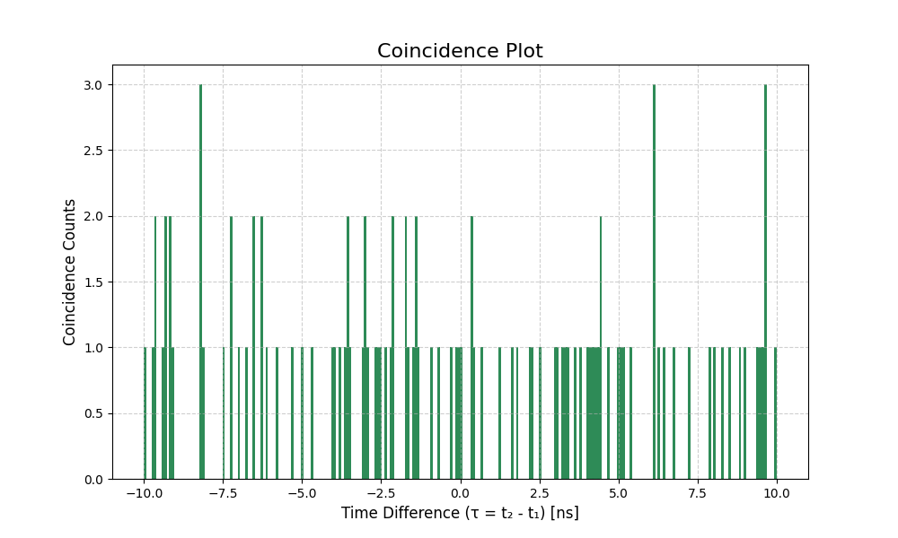

# SPAD Simulation

This project is a simulation tool for Single-Photon Avalanche Diode (SPAD) systems, based on the concepts described in https://arxiv.org/abs/2301.08475.

It simulates the time tags of photon arrivals at two detectors, taking into account various physical effects such as quantum efficiency, dark counts, timing jitter, dead time, and chromatic dispersion.

## Installation

1.  Clone the repository:
    ```bash
    git clone <repository-url>
    cd spad-sim
    ```

2.  Install the project and its dependencies using `pip`:
    ```bash
    pip install -e .
    ```

## Usage

The simulation is run from the command line using the `spad-sim` script.

```bash
spad-sim --help
```

This will show all the available parameters you can use to configure the simulation.

## Example Usage

Here is an example of how to run the simulation and generate a coincidence plot.

### Command

```bash
spad-sim --simulation_time_s 0.1 --distance_km 10 --plot-file coincidence_plot.png
```

### Output

```
Starting simulation...
Path 1 Loss: 10.0 dB -> 0.100 Transmission
Path 2 Loss: 10.0 dB -> 0.100 Transmission
Generated 49814 photon pairs at the source.
Calculated Dispersion Delay: 3400.00 ps (3.40 ns)
Applying dead time...
Simulation finished!
Detector 1 registered 21620 events.
Detector 2 registered 21696 events.

Saving time tags to time_tags.csv...
Save complete.

Searching for coincidences within a +/- 10.00 ns window...
Found 108 potential coincidence events.

Plotting coincidence histogram...
Histogram Bin Width (Coincidence Window): 0.08 ns
Calculated Number of Bins: 250
Saving plot to coincidence_plot.png...
```

### Coincidence Plot

